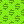
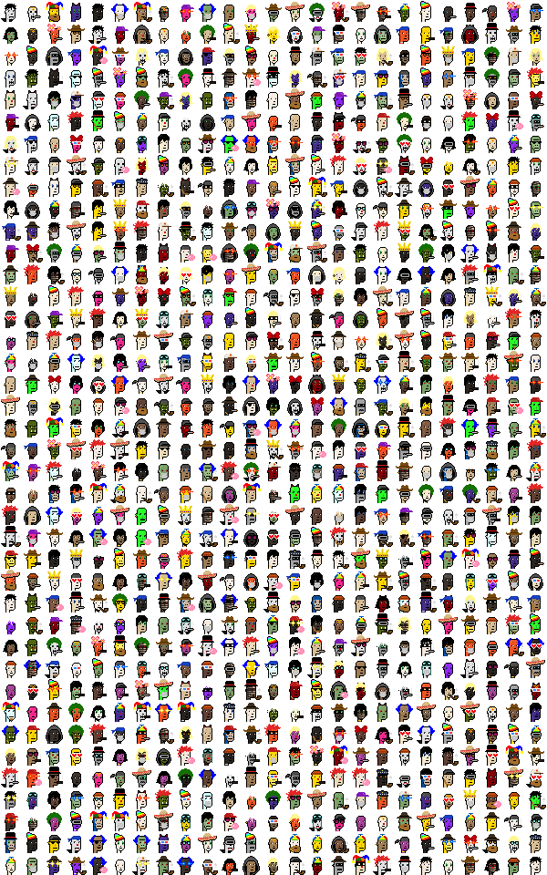

# (Pixel Art) Ordinal Punk Sandbox


How-tos and sample scripts to generate your own ordinal punk pixel art and more


## Scripts - What's News?

### /spritesheet

Generate spritesheet image & (meta)dataset for easy (re)use
that incl. all archetypes and accessories
used in 100 ordinal punks collection


<details>
<summary markdown="1">4x</summary>


</details>


### /dollar

Turn your ordinal punks into greenback dollar bills. (Money printer go)  brrr.......


<details>
<summary markdown="1">4x</summary>


</details>


### /gold

Turn your "classic" ordinal punks into all golden ordinal punks ...


<details>
<summary markdown="1">4x</summary>


</details>


### /punkettes

Turn your "classic" ordinal punks into an extraordinal all-women punk / all punkette edition...


<details>
<summary markdown="1">4x</summary>


</details>


### /marilyns

Turn your "classic" ordinal punks into an all-women punkette blondes have more fun bombshells...


<details>
<summary markdown="1">4x</summary>


</details>


### /men

Turn your "classic" ordinal punks into an all-men punk edition...


<details>
<summary markdown="1">4x</summary>


</details>


### /taprootwizards

Turn your "classic" ordinal punks into an all-men taproot wizards edition...


<details>
<summary markdown="1">4x</summary>


</details>


### /wallstreetbets

Turn your "classic" ordinal punks into an all-men wall street bets "you-only-live-once" degen edition...


<details>
<summary markdown="1">4x</summary>


</details>


### /humans

Turn your "classic" ordinal punks into an all-human punk edition -
using the (dr. ellis) monk¹ skin tones (01/02/03/04/05/06/07/08/09/10)...


<details>
<summary markdown="1">4x</summary>


</details>


¹: See [Skin Tone Research @ Google A.I.](https://skintone.google/) for background reading.


### /apes

Turn your "classic" ordinal punks into a planet ape (note: the mummies become trippy apes and the skeletons become white apes)...


<details>
<summary markdown="1">4x</summary>


</details>


### /lasereyes

Turn your "classic" ordinal punks into all-laser-eyed "beam to-the-moon" superpower punks...


<details>
<summary markdown="1">4x</summary>


</details>


### /saudis

Turn your "classic" ordinal punks into saudi royal sheiks (and habibis)...


<details>
<summary markdown="1">4x</summary>


</details>


### /coins

Turn your "classic" ordinal punks into gold/silver/bronze coins...


<details>
<summary markdown="1">4x</summary>


</details>


<details>
<summary markdown="1">4x</summary>


</details>


<details>
<summary markdown="1">4x</summary>


</details>


### /bluechip

Turn your "classic" ordinal punks into blue (poker) chips...


<details>
<summary markdown="1">4x</summary>


</details>


### /bitcoin

Turn your "classic" ordinal punks into true "Bitcoin Ordinal Punks"  with an orange bitcoin (mosaic) tile background
  ...

3x3 ("The Invisibles")


<details>
<summary markdown="1">4x</summary>


</details>


<details>
<summary markdown="1">4x</summary>


</details>


Breaking news - sponsored by the fed(eral reserve) - a free airdrop variant that turns "classic" ordinal punks into
"The Ordinal Punks Reserve" with a green dollar (mosaic)
tile background ...
  ...

3x3 ("The Invisibles")


<details>
<summary markdown="1">4x</summary>


</details>


<details>
<summary markdown="1">4x</summary>


</details>


... or with a blue euro (mosaic)
tile background ...
 ...

3x3 ("The Invisibles")


<details>
<summary markdown="1">4x</summary>


</details>


<details>
<summary markdown="1">4x</summary>


</details>


... or with a red pound (mosaic)
tile background ...
 ...

3x3 ("The Invisibles")


<details>
<summary markdown="1">4x</summary>


</details>


<details>
<summary markdown="1">4x</summary>


</details>


### /orangepill

Turn your "classic" ordinal punks into an all orange pill(ed) edition...


<details>
<summary markdown="1">4x</summary>


</details>

... with all-laser-eyed "beam to-the-moon" superpower...


<details>
<summary markdown="1">4x</summary>


</details>


### /sketch

Turn your "classic" ordinal punks into a black & white (1-bit) pencial drawing sketches (49x49px) edition (with line 1px, spacing 1px - 49x49px)...


... (black <=> white) inverted ...


... orange pilled ...


... with colors back ...


<details>
<summary markdown="1">4x</summary>


... (black <=> white) inverted ...


... orange pilled ...


... with colors back ...


</details>


... (with line 1px, spacing 4px - 121x121px)...


... (black <=> white) inverted ...


... with colors back ...


### /neon

Turn your black & white (1-bit) ordinal punk sketches into a neon light glow edition...


<details>
<summary markdown="1">4x</summary>


</details>


### /led

Turn your "classic" ordinal punks into a led light edition (led 4px, spacing 1px)...


### /polaroid

Turn your "classic" ordinal punks into insta polaroid photos...


<details>
<summary markdown="1">4x</summary>


</details>


### /hollywood

The drum roll please...
turn your "classic" ordinal punks into hollywood 35mm film stars & starlets...


<details>
<summary markdown="1">4x</summary>


</details>


### /fastfood

Turn your "classic" ordinal punks into fast food "Do you wanna fries with that?' crypto bros (& sis) - the mc'ds exclusive edition ...


<details>
<summary markdown="1">4x</summary>


</details>

... the mc'ds plus burger king, wendy's, kentucky fried chicken (kfc),
jack in the box, white castle, pizza hut,
domino's pizza, baskin-robbins, dunkin' donuts and subway sandwich inclusive edition ...


<details>
<summary markdown="1">4x</summary>


</details>


### /hoodies

Turn your "classic" ordinal punks into hoodie nation...


<details>
<summary markdown="1">4x</summary>


</details>


### /onesies

Turn your "classic" ordinal punks into frog onesies...


<details>
<summary markdown="1">4x</summary>


</details>

... or bear onesies ...


<details>
<summary markdown="1">4x</summary>


</details>


## Bonus  - 1000 More Ordinal Punks

### /1000more

Yes, you can.  Let's generate a thousand more never-before-seen ultra-rare
ordinal punks.

Step 1:  Generate the random attributes / meta data ...

````
id, type, accessories
1, ape male gold, messy hair / spots
2, zombie female, cap forward / earring
3, male 1, jester hat / mole / big beard
4, orc male, demon horns / clown eyes green
5, demon male, messy hair / spots
6, male 1, clown hair blue / chinstrap / medical mask
7, male orange, jester hat / chinstrap / pipe
8, female 4, cap forward / green eye shadow / silver chain
9, female 4, blonde short / rosy cheeks / gold chain
10, vampire male, demon horns / big beard
...
````

(Source: [morepunks.csv](1000more/morepunks.csv))


Step 2: Generate more ordinal punks....




## Questions? Comments?

Post them over at the [Help & Support](https://github.com/geraldb/help) page. Thanks.


