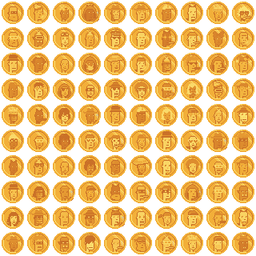

# (Pixel Art) Ordinal Punk Sandbox

How-tos and sample scripts to generate your own ordinal punk pixel art and more

## Scripts - What's News?

### /spritesheet

Generate spritesheet image & (meta)dataset for easy (re)use
that incl. all archetypes and accessories
used in 100 ordinal punks collection

4x

### /dollar

Turn your ordinal punks into greenback dollar bills. (Money printer go)  brrr.......

4x

### /gold

Turn your "classic" ordinal punks into all golden ordinal punks ...

4x

### /punkettes

Turn your "classic" ordinal punks into an extraordinal all-women punk / all punkette edition...

4x

### /men

Turn your "classic" ordinal punks into an all-men punk edition...

4x

### /humans

Turn your "classic" ordinal punks into an all-human punk edition -
using the (dr. ellis) monk¹ skin tones (01/02/03/04/05/06/07/08/09/10)...

4x

¹: See [Skin Tone Research @ Google A.I.](https://skintone.google/) for background reading.

### /orangepill

Turn your "classic" ordinal punks into an all orange pill(ed) edition...

4x

### /coins

Turn your "classic" ordinal punks into gold/silver/bronze coins...

4x

4x

## Questions? Comments?

Post them over at the [Help & Support](https://github.com/geraldb/help) page. Thanks.

