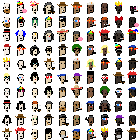

# (Pixel Art) Ordinal Punk Sandbox

How-tos and sample scripts to generate your own ordinal punk pixel art and more

## Scripts - What's News?

### /spritesheet

Generate spritesheet image & (meta)dataset for easy (re)use
that incl. all archetypes and accessories
used in 100 ordinal punks collection

4x

### /dollar

Turn your ordinal punks into greenback dollar bills. (Money printer go)  brrr.......

4x

### /gold

Turn your "classic" ordinal punks into all golden ordinal punks ...

4x

### /punkettes

Turn your "classic" ordinal punks into an extraordinal all-women punk / all punkette edition...

4x

### /men

Turn your "classic" ordinal punks into an all-men punk edition...

4x

### /humans

Turn your "classic" ordinal punks into an all-human punk edition -
using the (dr. ellis) monk¹ skin tones (01/02/03/04/05/06/07/08/09/10)...

4x

¹: See [Skin Tone Research @ Google A.I.](https://skintone.google/) for background reading.

### /apes

Turn your "classic" ordinal punks into a planet ape (note: the mummies become trippy apes and the skeletons become white apes)...

4x

### /orangepill

Turn your "classic" ordinal punks into an all orange pill(ed) edition...

4x

### /coins

Turn your "classic" ordinal punks into gold/silver/bronze coins...

4x

4x

4x

### /bluechip

Turn your "classic" ordinal punks into blue (poker) chips...

4x

### /bitcoin

Turn your "classic" ordinal punks into true "Bitcoin Ordinal Punks"  with an orange bitcoin (mosaic) tile background
  ...

3x3 ("The Invisibles")

4x

4x

Breaking news - sponsored by the fed(eral reserve) - a free airdrop variant that turns "classic" ordinal punks into
"The Ordinal Punks Reserve" with a green dollar (mosaic)
tile background ...
  ...

3x3 ("The Invisibles")

4x

4x

... or with a blue euro (mosaic)
tile background ...
 ...

3x3 ("The Invisibles")

4x

4x

... or with a red pound (mosaic)
tile background ...
 ...

3x3 ("The Invisibles")

4x

4x

### /sketch

Turn your "classic" ordinal punks into a black & white (1-bit) pencial drawing sketches (49x49px) edition (with line 1px, spacing 1px - 49x49px)...

... (black <=> white) inverted ...

... orange pilled ...

4x

... (black <=> white) inverted ...

... orange pilled ...

... (with line 1px, spacing 4px - 121x121px)...

... (black <=> white) inverted ...

### /neon

Turn your black & white (1-bit) ordinal punk sketches into a neon light glow edition...

4x

### /led

Turn your "classic" ordinal punks into a led light edition (led 4px, spacing 1px)...

### /polaroid

Turn your "classic" ordinal punks into insta polaroid photos...

4x

### /hollywood

The drum roll please...
turn your "classic" ordinal punks into hollywood 35mm film stars & starlets...

4x

## Questions? Comments?

Post them over at the [Help & Support](https://github.com/geraldb/help) page. Thanks.

